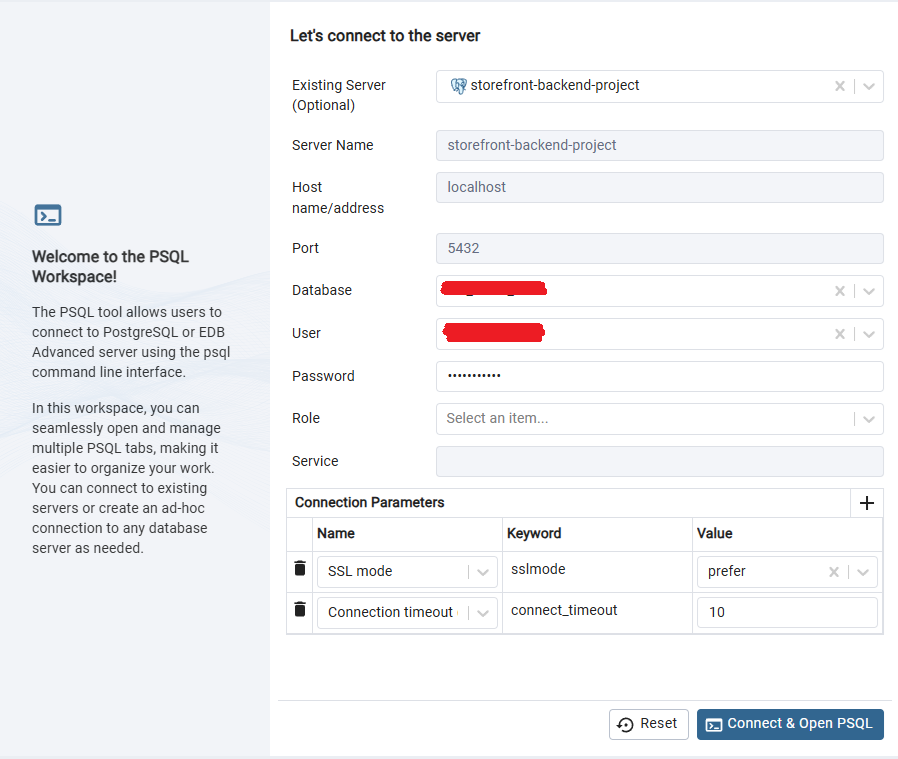

# Storefront Backend Project

## Setup and Running the App

1. Clone this repo `git clone https://github.com/benthedeveloper/storefront-backend-project.git`
2. Install NodeJS (this app has been tested on the latest LTS version, which is v24.18.0 as of July 2026). I recommend using [NVM (Node Version Manager)](nvmnode.com) to easily switch between different versions of Node for different projects as needed. This should also install NPM.
3. Change directory to the repo `cd storefront-backend-project`, then install dependencies: Run `npm install`.
4. Create a new environment variable file (named `.env`) in the root folder, refer to the `.env.example` file.
   - Define the connection details for both development and testing databases, including:
     - `POSTGRES_PORT`: The port at which the PostgreSQL database is running. **Default is `5432`**.
     - `POSTGRES_HOST`: The database host (e.g., `127.0.0.1` or `localhost`).
     - `POSTGRES_DB`: The name of the development database (e.g., `full_stack_dev`).
     - `POSTGRES_TEST_DB`: The name of the test database (e.g., `full_stack_test`).
     - `ENV`: The application environment mode, set to `dev` for development.
     - `POSTGRES_USER`: The database user.
     - `POSTGRES_PASSWORD`: The database password.
   - For local development, set `CORS_ORIGIN=http://localhost:3000` (assuming SERVER_PORT is set to 3000).
5. Install [Docker Desktop](https://www.docker.com/products/docker-desktop/) if you have not yet done so, and make sure Docker Desktop is running.
6. Run `docker compose up -d postgres` in a terminal to start the Docker container with the Postgres database.
   - By default, Docker Compose maps host port `5432` to the container port `5432`.
7. Run `npm run migrate:up` to run database migrations, which will create the tables in the `POSTGRES_DB` database on the port set in your `.env` file (`POSTGRES_PORT`, defaulting to `5432`).
8. In another terminal, run `npm run watch` to start the server on localhost.
   - If SERVER_PORT is set to `3000` in .env for example, then if you open a browser at `http://localhost:3000/api`, then you should see message "Main api route" in your browser.
9. You may now make calls to the API. Refer to the [REQUIREMENTS.md](REQUIREMENTS.md) document for how to use the API.
10. _Note:_ Token expiration is set to 1 hour. If you attempt to make a call to a protected route (such as create a new product), and your token is expired, you will get an error response: `"error": "Invalid or expired token."`. If that happens, then you must make a call to the `/api/users/authenticate` route with the correct username/password (or create a new user) to get a new Bearer token, copy that, and include it in the Authorization headers of your requests to protected routes.

I recommend installing Postman or any similar API platform for testing API routes. You can set up Postman to use a Post-response script for the user create/authenticate routes to set a JWT token variable, which can be used for the protected routes, so you don't have to copy and update the authorization headers for protected routes, which is tedious.

## Technologies

This application makes use of the following libraries:

- Postgres for the database
- Node/Express for the application logic
- dotenv from npm for managing environment variables
- db-migrate from npm for migrations
- jsonwebtoken from npm for working with JWTs
- jasmine from npm for testing
- supertest from npm for testing Express routes

## Testing

- Make sure both the development database and test database are specified in your `.env` file.
- Run `npm run test` to run all Jasmine tests for models and routes. This script will automatically prepare the test database, run migrations against it, and execute all tests using `POSTGRES_TEST_DB`.

## Connecting to the database

After going through the setup, make sure Docker is up and running, and that you have run `npm run migrate:up`. To connect to the Postgres database in the Docker container, you can use a tool such as PgAdmin 4, DBeaver, or VS Code database extensions.

Use the connection details specified in your `.env` file:

- **Host**: `127.0.0.1` (or `localhost`)
- **Port**: The port defined in your environment file as `POSTGRES_PORT` (Default port is **`5432`**).
- **Database**: The database name defined as `POSTGRES_DB` (for development) or `POSTGRES_TEST_DB` (for testing).
- **Username**: The user defined as `POSTGRES_USER` (e.g. `full_stack_user`).
- **Password**: The password defined as `POSTGRES_PASSWORD` (e.g. `password123`).

